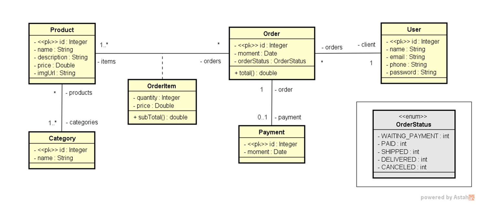
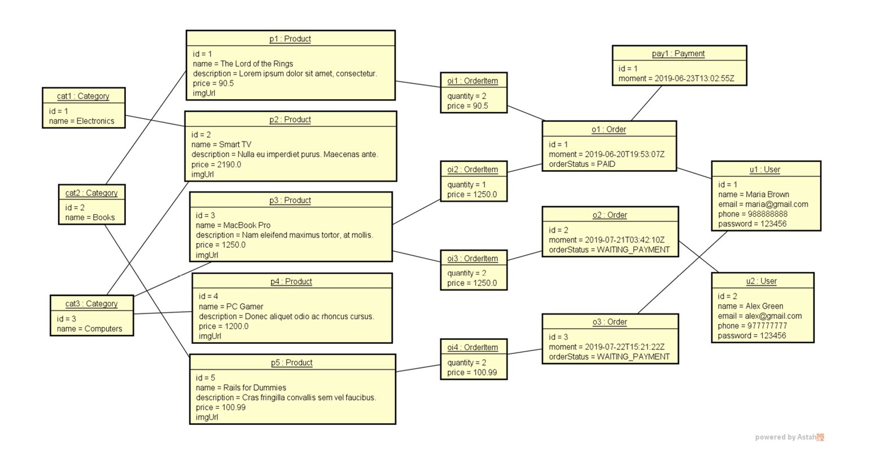

# Supermarket System
___

Este projeto foi desenvolvido utilizando a linguagem Java, com o objetivo para criar uma solução eficiente de 
operações de supermercado. Para auxiliar no entendimento e na implementação do sistema, foi 
elaborada uma documentação detalhada.

## Tabela de conteúdos
- [Tecnologias utilizadas](#Tecnologias-utilizadas)
- [Como clonar o projeto](#Como-clonar-o-projeto)
- [Foco do sistema](#Foco-do-sistema)
- [h2 properties](#properties)
- [Arquitetura](#arquitetura)
- [Features](#features)

## Tecnologias utilizadas:
* Java
* SpringBoot
* Maven
* H2 database
* Spring Data JPA

## Como clonar o projeto:

1. **Verifique se o Git está instalado**
    - No terminal, execute:
      ```bash
      git --version
      ```

2. **Escolha um local no seu computador**
    - Navegue até o diretório onde deseja clonar o repositório:
      ```bash
      cd /caminho/do/diretorio
      ```

3. **Execute o comando de clonagem**
    - Use o comando:
      ```bash
      git clone <https://github.com/devpaulojr/SupermarketSystem>
      ```

4. **Acesse o diretório clonado**
    - Entre no diretório recém-criado:
      ```bash
      cd nome-do-repositorio
      ```

5. **Confirme que o repositório foi clonado corretamente**
    - Liste os arquivos para verificar:
      ```bash
      ls
      ```

## Foco do sistema
* Decide atualizar esse projeto, pois muitas pessoas tem dúvidas de como dar o primeiro passo com SpringBoot.
* Esse projeto é focado na implementação conceitual, lógica de programação, APIs REST, organização das camadas.


     Dica de instância em objetos da classe:
      
        User u1 = new User(null, "paulo", "paulo@gmail.com", "40028922", "152333");
        User u2 = new User(null, "clara", "clara@gmail.com", "80071525", "999944");
      
    
        Order o1 = new Order(null, Instant.parse("2019-06-20T19:53:07Z"), OrderStatus.PAID ,u1);
        Order o2 = new Order(null, Instant.parse("2019-07-21T03:42:10Z"), OrderStatus.WAITING_PAYMENT ,u2);
        Order o3 = new Order(null, Instant.parse("2019-07-22T15:21:22Z"), OrderStatus.WAITING_PAYMENT, u1);
    
        Category cat1 = new Category(null, "Electronics");
        Category cat2 = new Category(null, "Books");
        Category cat3 = new Category(null, "Computers");
    
        Product p1 = new Product(null, "The Lord of the Rings", "Lorem ipsum dolor sit amet, consectetur.", 90.5, "");
        Product p2 = new Product(null, "Smart TV", "Nulla eu imperdiet purus. Maecenas ante.", 2190.0, "");
        Product p3 = new Product(null, "Macbook Pro", "Nam eleifend maximus tortor, at mollis.", 1250.0, "");
        Product p4 = new Product(null, "PC Gamer", "Donec aliquet odio ac rhoncus cursus.", 1200.0, "");
        Product p5 = new Product(null, "Rails for Dummies", "Cras fringilla convallis sem vel faucibus.", 100.99, "");

        OrderItem oi1 = new OrderItem(o1, p1, 2, p1.getPrice());
        OrderItem oi2 = new OrderItem(o1, p3, 1, p3.getPrice());
        OrderItem oi3 = new OrderItem(o2, p3, 2, p3.getPrice());
        OrderItem oi4 = new OrderItem(o3, p5, 2, p5.getPrice());

        Payment pay1 = new Payment(null, Instant.parse("2019-06-20T22:53:07Z"), o1);


## properties 

 ```
 # datasource
spring.datasource.driverClassName=org.h2.Driver
spring.datasource.url=jdbc:h2:mem:testdb
spring.datasource.username=sa
spring.datasource.password=

# jpa
spring.jpa.database-platform=org.hibernate.dialect.H2Dialect
spring.jpa.hibernate.ddl-auto=update
spring.jpa.properties.hibernate.show_sql=true
spring.jpa.properties.hibernate.format_sql=true

# h2
spring.h2.console.enabled=true
spring.h2.console.path=/h2-console
 ```

## Arquitetura
Arquitetura do projeto de ser instânciado na memória da seguinte forma:



## Features
Você deverá instanciar os objetos em memória da seguinte forma:



